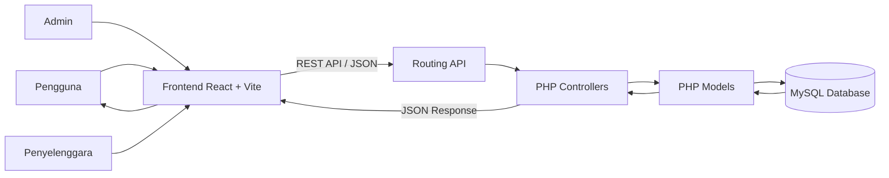

<div align="center">


<p>
  Platform berbasis web untuk menemukan, mengelola, memverifikasi, dan melakukan pemesanan tiket berbagai kegiatan desa dalam satu sistem terintegrasi.
</p>

<p>
  
  
  
  
</p>

<p>
  
  
  
  
</p>

<a href="https://thevillage.sisteminformasikotacerdas.id">
  
</a>
<a href="#-cara-menjalankan">
  
</a>
<a href="#-dokumentasi-api">
  
</a>

</div>

---

## Tentang The Village

**The Village** merupakan aplikasi sistem informasi acara desa yang dirancang untuk memusatkan penyebaran informasi kegiatan, pengelolaan event, pemesanan tiket, transaksi, serta proses verifikasi acara.

Sistem ini membantu:

- **Masyarakat** menemukan acara, melihat detail kegiatan, membeli tiket, serta mengakses invoice dan tiket digital.
- **Penyelenggara** membuat dan mengelola event, tiket, tim, pembayaran, peserta, dan laporan.
- **Administrator** memverifikasi event, mengelola pengguna, memantau transaksi, menjawab FAQ, dan melihat statistik sistem.

> [!NOTE]
> Proyek ini dikembangkan sebagai **Tugas Besar Mata Kuliah Pemrograman Web** oleh Kelompok 3, Program Studi Terapan Sistem Informasi Kota Cerdas, Fakultas Ilmu Terapan, Universitas Telkom.

---

## Daftar Isi

- [Fitur Utama](#-fitur-utama)
- [Hak Akses Pengguna](#-hak-akses-pengguna)
- [Teknologi](#-teknologi)
- [Arsitektur Sistem](#-arsitektur-sistem)
- [Struktur Folder](#-struktur-folder)
- [Cara Menjalankan](#-cara-menjalankan)
- [Akun Demo](#-akun-demo)
- [Dokumentasi API](#-dokumentasi-api)
- [Screenshot](#-screenshot)
- [Tim Pengembang](#-tim-pengembang)
- [Pemanfaatan AI](#-pemanfaatan-ai)
- [Catatan Keamanan](#-catatan-keamanan)

---

## Fitur Utama

### Untuk Masyarakat

- Melihat halaman beranda dan event terbaru.
- Mencari event berdasarkan kata kunci.
- Menyaring event berdasarkan kategori dan wilayah.
- Melihat detail acara, jadwal, lokasi, harga, dan ketersediaan tiket.
- Melakukan registrasi dan login.
- Memilih serta membeli tiket.
- Memilih metode pembayaran.
- Melihat invoice dan status transaksi.
- Melihat tiket digital dan riwayat transaksi.
- Mengakses peta lokasi event.
- Membaca dan mengirim pertanyaan melalui FAQ.

### Untuk Penyelenggara

- Melihat statistik dashboard organizer.
- Menambahkan event baru.
- Mengubah dan menghapus event.
- Mengunggah gambar event.
- Mengelola tiket dan kuota peserta.
- Melihat data pembayaran.
- Mengelola anggota tim penyelenggara.
- Mengatur peran dan hak akses tim.
- Melihat laporan kegiatan.
- Memantau status verifikasi event.

### Untuk Administrator

- Melihat statistik keseluruhan sistem.
- Memverifikasi, menerima, atau menolak event.
- Mengelola data pengguna.
- Memantau transaksi dan pembayaran.
- Mengelola FAQ.
- Melihat statistik berdasarkan wilayah.
- Memantau data tiket dan event.
- Mengakses data pendukung seperti CCTV dan lokasi.

---

## Hak Akses Pengguna

| Role | Akses Utama |
|---|---|
| `USER` | Event, checkout, invoice, tiket, profil, FAQ, dan peta |
| `PENYELENGGARA` | Dashboard organizer dan pengelolaan event |
| `TICKET_ADMIN` | Pengelolaan tiket dan peserta |
| `PAYMENT_ADMIN` | Monitoring pembayaran |
| `TRAFFIC_ADMIN` | Monitoring lalu lintas dan laporan |
| `CONTENT_ADMIN` | Pengelolaan konten event |
| `VIEWER` | Akses baca dashboard organizer |
| `ADMIN_BG` | Verifikasi dan pengawasan sistem |
| `ADMIN_SYSTEM` | Administrasi sistem secara menyeluruh |

---

## Teknologi

<table>
  <tr>
    <th>Bagian</th>
    <th>Teknologi</th>
    <th>Kegunaan</th>
  </tr>
  <tr>
    <td>Frontend</td>
    <td>React 18 dan Vite</td>
    <td>Membangun antarmuka berbasis komponen dan SPA</td>
  </tr>
  <tr>
    <td>Routing</td>
    <td>React Router DOM</td>
    <td>Mengelola navigasi tanpa reload halaman</td>
  </tr>
  <tr>
    <td>Styling</td>
    <td>CSS dan Tailwind CSS</td>
    <td>Membuat antarmuka responsif</td>
  </tr>
  <tr>
    <td>Icon</td>
    <td>Lucide React</td>
    <td>Menyediakan ikon antarmuka</td>
  </tr>
  <tr>
    <td>Chart</td>
    <td>Chart.js dan React Chart.js 2</td>
    <td>Menampilkan statistik dashboard</td>
  </tr>
  <tr>
    <td>Backend</td>
    <td>PHP Native MVC</td>
    <td>Mengelola API, autentikasi, dan logika bisnis</td>
  </tr>
  <tr>
    <td>Database</td>
    <td>MySQL</td>
    <td>Menyimpan data pengguna, event, tiket, dan transaksi</td>
  </tr>
  <tr>
    <td>Server Lokal</td>
    <td>XAMPP</td>
    <td>Menjalankan Apache dan MySQL</td>
  </tr>
</table>

---

## Arsitektur Sistem



### Alur Kerja

1. Pengguna melakukan aksi melalui antarmuka React.
2. Frontend mengirim request ke REST API.
3. Route menentukan controller yang sesuai.
4. Controller memvalidasi data dan memanggil model.
5. Model membaca atau menyimpan data pada MySQL.
6. Backend mengirim respons JSON.
7. React memperbarui tampilan berdasarkan respons tersebut.

---

## Struktur Folder

```text
TheVillage/
├── UI/
│   ├── src/
│   │   ├── api/                 # Konfigurasi request API
│   │   ├── components/          # Komponen antarmuka
│   │   ├── context/             # Auth dan toast context
│   │   ├── pages/
│   │   │   ├── admin/           # Dashboard administrator
│   │   │   ├── auth/            # Login dan registrasi
│   │   │   ├── organizer/       # Dashboard organizer
│   │   │   ├── public/          # Home, event, FAQ, dan peta
│   │   │   └── user/            # Checkout, invoice, dan profil
│   │   ├── App.jsx
│   │   └── main.jsx
│   ├── package.json
│   └── vite.config.js
│
├── server/
│   ├── app/
│   │   ├── controllers/         # Pengelola request API
│   │   ├── helpers/             # Auth dan response helper
│   │   ├── middleware/          # Pemeriksaan autentikasi
│   │   └── models/              # Query dan akses database
│   ├── config/
│   │   └── database.php         # Konfigurasi database
│   ├── database/
│   │   └── the_village.sql      # File database
│   ├── public/
│   │   ├── index.php            # Entry point API
│   │   └── uploads/events/      # Penyimpanan gambar event
│   └── routes/
│       └── api.php              # Daftar route API
│
├── DOKUMENTASI.md
└── README.md
```

---

## Cara Menjalankan

### Persyaratan

Pastikan perangkat telah memiliki:

- PHP 8 atau versi yang kompatibel.
- MySQL atau MariaDB.
- XAMPP.
- Node.js 18 atau lebih baru.
- npm.
- Git.

<details>
<summary><strong>1. Clone repositori</strong></summary>

```bash
git clone https://github.com/USERNAME/NAMA-REPOSITORY.git
```

Kemudian letakkan folder proyek di:

```text
C:\xampp\htdocs\TheVillage
```

</details>

<details>
<summary><strong>2. Import database</strong></summary>

1. Jalankan Apache dan MySQL melalui XAMPP.
2. Buka phpMyAdmin.
3. Buat database baru dengan nama:

```sql
CREATE DATABASE the_village;
```

4. Import file berikut:

```text
server/database/the_village.sql
```

</details>

<details>
<summary><strong>3. Atur koneksi database</strong></summary>

Buka:

```text
server/config/database.php
```

Gunakan konfigurasi lokal berikut:

```php
define('DB_HOST', 'localhost');
define('DB_NAME', 'the_village');
define('DB_USER', 'root');
define('DB_PASS', '');
```

</details>

<details>
<summary><strong>4. Jalankan frontend</strong></summary>

Buka terminal pada folder UI:

```bash
cd C:\xampp\htdocs\TheVillage\UI
npm install
npm run dev
```

Akses aplikasi melalui:

```text
http://localhost:5173
```

Vite akan meneruskan request `/api` menuju backend PHP melalui konfigurasi proxy.

</details>

<details>
<summary><strong>5. Build untuk production</strong></summary>

```bash
cd UI
npm run build
```

File production akan dibuat pada folder:

```text
UI/dist
```

</details>

---

## Akun Demo

| Role | Email | Password |
|---|---|---|
| Administrator | `admin@village.test` | `password` |
| Penyelenggara | `organizer@village.test` | `password` |
| Masyarakat | `user@village.test` | `password` |

> [!WARNING]
> Akun tersebut hanya digunakan untuk kebutuhan demonstrasi. Ganti password sebelum aplikasi digunakan pada lingkungan produksi.

---

## Dokumentasi API

Base URL lokal:

```text
http://localhost/TheVillage/server/public
```

Saat menggunakan Vite:

```text
/api
```

### Endpoint Publik

| Method | Endpoint | Keterangan |
|---|---|---|
| `POST` | `/login` | Login pengguna |
| `POST` | `/register` | Registrasi pengguna |
| `GET` | `/events` | Mengambil seluruh event |
| `GET` | `/events/{id}` | Mengambil detail event |
| `GET` | `/categories` | Mengambil kategori event |
| `GET` | `/cities` | Mengambil data kota |
| `GET` | `/locations` | Mengambil lokasi event |
| `GET` | `/testimonials` | Mengambil testimoni |
| `GET` | `/payment-methods` | Mengambil metode pembayaran |
| `GET` | `/faq` | Mengambil FAQ |
| `POST` | `/faq-submit` | Mengirim pertanyaan |

### Endpoint Pengguna

| Method | Endpoint | Keterangan |
|---|---|---|
| `GET` | `/profile` | Mengambil profil pengguna |
| `GET` | `/my-tickets` | Mengambil tiket pengguna |
| `GET` | `/my-transactions` | Mengambil riwayat transaksi |
| `GET` | `/my-transactions/{id}` | Mengambil detail transaksi |
| `POST` | `/checkout` | Memproses pembelian tiket |

### Endpoint Organizer

| Method | Endpoint | Keterangan |
|---|---|---|
| `GET` | `/organizer/dashboard-stats` | Statistik organizer |
| `GET` | `/organizer/events` | Daftar event organizer |
| `POST` | `/organizer/events` | Menambahkan event |
| `PUT` | `/organizer/events/{id}` | Mengubah event |
| `DELETE` | `/organizer/events/{id}` | Menghapus event |
| `GET` | `/organizer/payments` | Data pembayaran |
| `GET` | `/organizer/team` | Daftar anggota tim |
| `POST` | `/organizer/team` | Menambahkan anggota tim |
| `GET` | `/organizer/tickets` | Data tiket |
| `GET` | `/organizer/reports` | Laporan organizer |

### Endpoint Administrator

| Method | Endpoint | Keterangan |
|---|---|---|
| `GET` | `/admin/dashboard-stats` | Statistik administrator |
| `GET` | `/admin/events` | Seluruh event |
| `GET` | `/admin/pending-events` | Event menunggu verifikasi |
| `POST` | `/admin/verify-event` | Verifikasi event |
| `GET` | `/admin/users` | Data pengguna |
| `GET` | `/admin/transactions` | Data transaksi |
| `GET` | `/admin/cctv` | Data CCTV |
| `GET` | `/admin/faq-pending` | Pertanyaan belum dijawab |
| `POST` | `/admin/faq-answer` | Menjawab FAQ |
| `GET` | `/admin/geo-stats` | Statistik wilayah |

---

## Screenshot

Buat folder berikut pada repositori:

```text
docs/screenshots/
```

Kemudian simpan screenshot dengan nama:

```text
home.png
events.png
event-detail.png
checkout.png
organizer-dashboard.png
admin-dashboard.png
```

Setelah gambar tersedia, aktifkan bagian berikut:

<!--
<table>
  <tr>
    <td align="center"><strong>Halaman Beranda</strong></td>
    <td align="center"><strong>Daftar Event</strong></td>
  </tr>
  <tr>
    <td></td>
    <td></td>
  </tr>
  <tr>
    <td align="center"><strong>Dashboard Organizer</strong></td>
    <td align="center"><strong>Dashboard Admin</strong></td>
  </tr>
  <tr>
    <td></td>
    <td></td>
  </tr>
</table>
-->

---

## Tim Pengembang

<table>
  <tr>
    <th>Nama</th>
    <th>NIM</th>
    <th>Kontribusi Utama</th>
  </tr>
  <tr>
    <td><strong>Cintia Desti Wahyuni</strong></td>
    <td>707012500080</td>
    <td>Autentikasi, login, registrasi, session, dan pengujian akses pengguna</td>
  </tr>
  <tr>
    <td><strong>Moehamad Farellino Rizqika M.</strong></td>
    <td>707012500030</td>
    <td>Halaman beranda, daftar event, detail event, dan pengelolaan event organizer</td>
  </tr>
  <tr>
    <td><strong>Naufal Rafif Nurqodri</strong></td>
    <td>707012530004</td>
    <td>Lead developer, database, ticketing, transaksi, dashboard admin, integrasi API, debugging, dan deployment</td>
  </tr>
</table>

<div align="center">

**Kelompok 3 — D4 Sistem Informasi Kota Cerdas**  
**Fakultas Ilmu Terapan — Universitas Telkom**

</div>

---

## Pemanfaatan AI

AI digunakan sebagai alat bantu dalam proses pengembangan dan dokumentasi:

- **Claude** membantu brainstorming ide dan debugging kode.
- **ChatGPT** membantu penyusunan laporan serta penyempurnaan CSS.
- **Google Gemini** membantu pencarian resource dan referensi data.
- **Stitch by Google** membantu eksplorasi palet warna dan ide desain.

Seluruh hasil tetap diperiksa, disesuaikan, dan diuji kembali oleh anggota kelompok.

---


<div align="center">


<strong>The Village</strong><br/>
Menghubungkan masyarakat, penyelenggara, dan kegiatan desa melalui teknologi.

</div>
